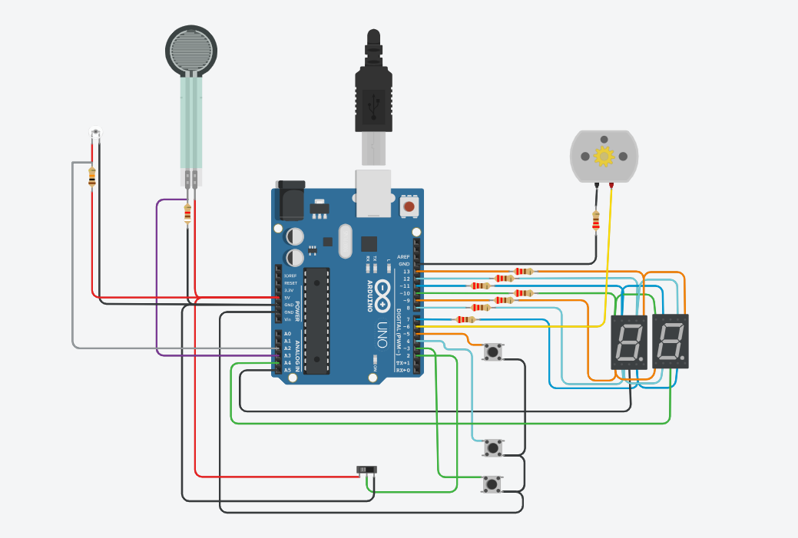

# Primer parcial - Parte 4



## Alumno
* Victor Amaya

### Proyecto:
Modificar la funcionalidad del proyecto, que muestre numeros impares en vez de los primos

#### Descripción:
Con todo lo modificado hasta la parte 3 que contaba los números enteros y primos del 0 al 99 de manera ascendente y descendente, usando todos los elementos propuestos. En esta parte se cambia la funcionalidad y en vez de los números primos se cuentan los números impares.

##### Uso en el proyecto
1. Se definen las constantes y se declaran las variables
```C
// se definen constantes
#define A 12
#define B 13
#define C 7
#define D 8
#define E 9
#define F 11
#define G 10
#define ASCEND 4
#define DESCEND 3
#define RESET 5
#define UNIT A4
#define TEN A5
#define OFF 0
#define TIMEDISPLAYON 10
#define SWITCH 2
#define MOTOR 6
#define FORCE_SENSOR A3
#define LIGHT_SENSOR A2

// Definicion de variables
int countDigit = 0;
int ascend = 1;
int prevAscend = 1;
int descend = 1;
int prevDescend = 1;
int reset = 1;
int prevReset = 1;
int switch_1 = 0;

```
2. En el setup se definen las entradas y las salidas
```C
void setup()
{
	pinMode(3, INPUT_PULLUP);
  	pinMode(4, INPUT_PULLUP);
  	pinMode(5, INPUT_PULLUP);
  	pinMode(7, OUTPUT);
  	pinMode(8, OUTPUT);
  	pinMode(9, OUTPUT);
  	pinMode(10, OUTPUT);
  	pinMode(11, OUTPUT);
  	pinMode(12, OUTPUT);
  	pinMode(13, OUTPUT);
  	pinMode(UNIT, OUTPUT);
  	pinMode(TEN, OUTPUT);
  	digitalWrite(UNIT, 0);
  	digitalWrite(TEN, 0);
  	printDigit(0);
}

```
3. En el loop, se genera el codigo para que cada elemento funcione de acuerdo a los especificado, haciendo uso del swtich, motor CC, sensor de fuerza y sensor de luz ambiental. Ademas se usa la función para el contar los numeros impares.
```C
void loop()
{
	
  	int pressed = keypressed();
  	int force = analogRead(FORCE_SENSOR);
  	int light = analogRead(LIGHT_SENSOR);
  	if(pressed == ASCEND)    
    {
      if (force > 900 || light > 20)
      {
    	countDigit++;
      	digitalWrite(MOTOR, HIGH);
      	if(countDigit > 99)
        {
        	countDigit = 0;
        }
      }
    }
  	
  	else if (pressed == DESCEND)
    {
      if(force == 0 || light < 20)
      {
    	countDigit--;
      	digitalWrite(MOTOR, LOW);
      	if(countDigit < 0)
        {
        	countDigit = 99;
        }
      }
    }
  
  	else if (pressed == RESET)
    {
    	countDigit = 0;
    }
  
  	switch_1 = digitalRead(SWITCH);
  	if(switch_1 == 1)//Si el switch esta en 1, cuenta los
      				 //numeros primos
    {
    	countDigit = imparNumber(countDigit, pressed);
      	//Se usa el contador como una variable, para leer
      	//la funcion de los numeros primos que tiene como
      	//parametros el contador y el boton presionado
    }
  
  	printCount(countDigit);
  	
}
```
4. El uso de las funciones:
* Esta funcion imprime los numeros del 0 al 9.
 ```C
void printDigit(int digit)
{
	digitalWrite(A,LOW);
  	digitalWrite(B,LOW);
  	digitalWrite(C,LOW);
  	digitalWrite(D,LOW);
  	digitalWrite(E,LOW);
  	digitalWrite(F,LOW);
  	digitalWrite(G,LOW);
  
  	switch(digit)
    {
    	case 1:
      {
      	digitalWrite(B,HIGH);
        digitalWrite(C,HIGH);
        break;
      }
      	case 2:
      {
      	digitalWrite(A,HIGH);
        digitalWrite(B,HIGH);
        digitalWrite(D,HIGH);
        digitalWrite(E,HIGH);
        digitalWrite(G,HIGH);
        break;
      }
      	case 3:
      {
      	digitalWrite(A,HIGH);
        digitalWrite(B,HIGH);
        digitalWrite(C,HIGH);
        digitalWrite(D,HIGH);
        digitalWrite(G,HIGH);
        break;
      }
      case 4:
      {
      	digitalWrite(B,HIGH);
        digitalWrite(C,HIGH);
        digitalWrite(F,HIGH);
        digitalWrite(G,HIGH);
        break;
      }
      case 5:
      {
      	digitalWrite(A,HIGH);
        digitalWrite(C,HIGH);
        digitalWrite(D,HIGH);
        digitalWrite(F,HIGH);
        digitalWrite(G,HIGH);
        break;
      }
      case 6:
      {
      	digitalWrite(A,HIGH);
        digitalWrite(C,HIGH);
        digitalWrite(D,HIGH);
        digitalWrite(E,HIGH);
        digitalWrite(F,HIGH);
        digitalWrite(G,HIGH);
        break;
      }
      case 7:
      {
      	digitalWrite(A,HIGH);
        digitalWrite(B,HIGH);
        digitalWrite(C,HIGH);
        break;
      }
      case 8:
      {
      	digitalWrite(A,HIGH);
        digitalWrite(B,HIGH);
        digitalWrite(C,HIGH);
        digitalWrite(D,HIGH);
        digitalWrite(E,HIGH);
        digitalWrite(F,HIGH);
        digitalWrite(G,HIGH);
        break;
      }
      case 9:
      {
      	digitalWrite(A,HIGH);
        digitalWrite(B,HIGH);
        digitalWrite(C,HIGH);
        digitalWrite(D,HIGH);
        digitalWrite(F,HIGH);
        digitalWrite(G,HIGH);
        break;
      }
      case 0:
      {
      	digitalWrite(A,HIGH);
        digitalWrite(B,HIGH);
        digitalWrite(C,HIGH);
        digitalWrite(D,HIGH);
        digitalWrite(E,HIGH);
        digitalWrite(F,HIGH);
        break;
      }
	}
}

```
* Esta función permite prender y apagar los displays de la unidad y la decena.

```C
void digitOn(int digito)
{
	if (digito == UNIT)
    {
    	digitalWrite(UNIT,LOW);
        digitalWrite(TEN,HIGH);
      	delay(TIMEDISPLAYON);        
    }
  	else if (digito == TEN)
    {
    	digitalWrite(UNIT,HIGH);
        digitalWrite(TEN,LOW);
      	delay(TIMEDISPLAYON);
    }
  	else
    {
    	digitalWrite(UNIT,HIGH);
        digitalWrite(TEN,HIGH);
    }
}

```
* Función que permite contar los numeros del 0 al 99 y viceversa.

```C
void printCount(int count)
{
	digitOn(OFF);
  	printDigit(count/10);
  	digitOn(TEN);
  	digitOn(OFF);
  	printDigit(count-10 * ((int)count/10));
  	digitOn(UNIT);
}
```
* Función que registra que se apretó una tecla y si ésta no estaba apretada antes.
```C
int keypressed(void)
{
	ascend = digitalRead(ASCEND);
  	descend = digitalRead(DESCEND);
  	reset = digitalRead(RESET);
  	if (ascend)
    {
    	prevAscend = 1;
    }
  	if (descend)
    {
    	prevDescend = 1;
    }
  	if (reset)
    {
    	prevReset = 1;
    }
  
  		if(ascend == 0 & ascend != prevAscend)
    	{
    		prevAscend = ascend;
      		return ASCEND;
    	}
  		if(descend == 0 & descend != prevDescend)
    	{
    		prevDescend = descend;
      		return DESCEND;
    	}
  		if(reset == 0 & reset != prevReset)
        {
        	prevReset = reset;
          	return RESET;
        }
 return 0;  
}
```
* Función que detecta si el numero es impar y los muestra ya sea de manera ascendente o descendente.
```C
int imparNumber(int digit, int position)
{
  bool impar = true;
    for(int i=0;i<digit;i++)
  {
  	if(digit%2 == 0)
    {
     impar = false;
    }
      
  }
   if(impar == false && position == ASCEND)
    
    {
      digit++;
      if(digit>99)
      	digit=0;
    }else if(impar == false && position == DESCEND)
    {
      digit--;
      if(digit<0)
      	digit=99;
    }else 
    {
      return digit;
    }
}

```

###### Link del proyecto
[tinkercard.com](https://www.tinkercad.com/things/gNdDVqC95WB-copy-of-segunda-parte-switch-parcial-1/editel?tenant=circuits)

